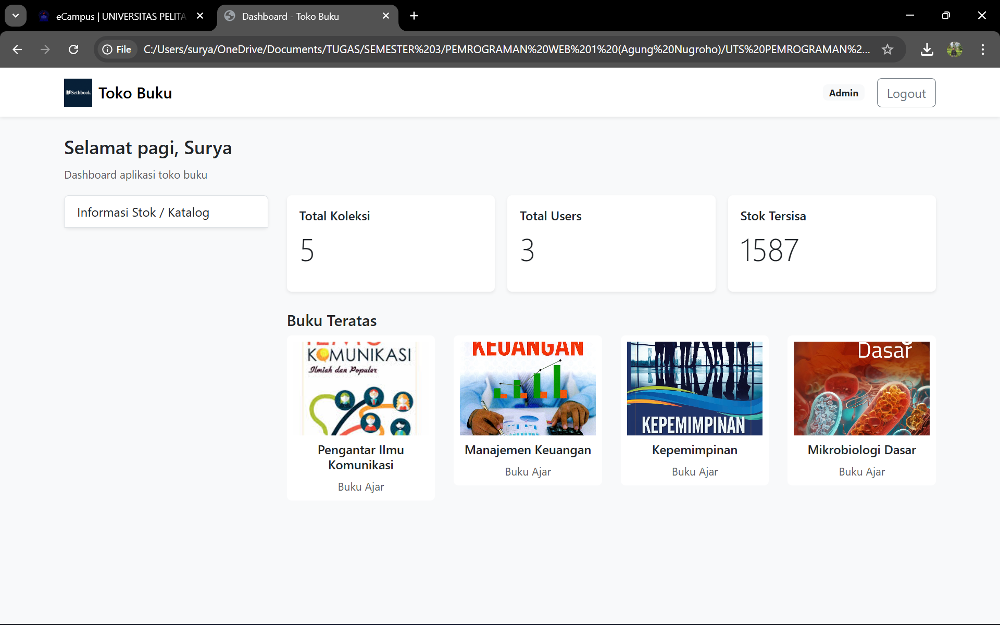
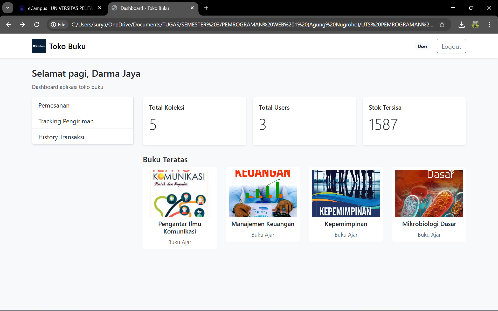

📚 Toko Buku - Sistem Manajemen Toko Buku Online
Aplikasi web sederhana untuk mengelola toko buku dengan fitur login multi-role (Admin & User), manajemen katalog, pemesanan, tracking pengiriman, dan riwayat transaksi.

Tampilkan Gambar

🎯 Fitur Utama
👤 Sistem Login & Role-Based Access
Admin: Akses penuh ke manajemen stok/katalog
User: Akses ke pemesanan, tracking, dan history transaksi
Autentikasi menggunakan email & password
Session management dengan sessionStorage
🔐 Akun Default
User
Email: darma@gmail.com | Password: darma123
Email: putra@gmail.com | Password: putra123
Admin
Email: surya@gmail.com | Password: surya123
📸 Screenshot Aplikasi
🔑 Halaman Login
Tampilkan Gambar
Halaman login dengan form email dan password. Mendukung login sebagai Admin atau User.

🏠 Dashboard
<table> <tr> <td width="50%">  </td> <td width="50%">  </td> </tr> <tr> <td align="center"><b>Admin Dashboard</b> Menu: Informasi Stok/Katalog</td> <td align="center"><b>User Dashboard</b> Menu: Pemesanan, Tracking, History</td> </tr> </table>
Fitur Dashboard:

Greeting sesuai waktu (pagi/siang/sore/malam)
Badge role (Admin/User)
Statistik: Total koleksi buku, total users, stok tersisa
Tampilan buku teratas dengan cover
Menu navigasi berbasis role
📦 Manajemen Stok (Admin Only)
Tampilkan Gambar
Admin dapat mengelola katalog buku: tambah, edit, dan hapus data buku.

Fitur:

Tabel katalog lengkap (Kode, Nama, Jenis, Edisi, Stok, Harga)
Button "Tambah Item" untuk menambah buku baru
Aksi Edit & Hapus untuk setiap item
Data tersimpan in-memory (session)
🛒 Pemesanan (User Only)
Tampilkan Gambar
Form pemesanan dengan keranjang belanja interaktif.

Fitur:

Form data pemesan (auto-filled dari profil user)
Dropdown pilih buku dari katalog
Keranjang belanja dengan fitur:
Tambah/kurang quantity (+/-)
Hapus item
Kalkulasi total otomatis
Button "Place Order" untuk submit pesanan
Generate Delivery Order (DO) otomatis
📍 Tracking Pengiriman (User Only)
Tampilkan Gambar
Daftar DO milik user dan form pencarian DO.

Tampilkan Gambar
Detail tracking dengan timeline perjalanan paket dan tombol simulasi progress.

Fitur:

Search bar untuk cari DO berdasarkan nomor
List semua DO milik user yang sedang login
Detail tracking menampilkan:
Nama penerima
Status pengiriman (Dalam Proses, Dalam Perjalanan, Selesai Antar)
Info ekspedisi, tanggal kirim, nomor paket
Total pembayaran
Timeline perjalanan paket
Simulate Progress: Tombol untuk demo update status (untuk testing)
📜 History Transaksi (User Only)
Tampilkan Gambar
Riwayat transaksi lengkap dengan detail items yang dibeli.

Fitur:

Daftar transaksi user (sorted terbaru)
Detail per transaksi:
Nomor DO
Tanggal pemesanan
Status (Dalam Proses, Selesai)
Total pembayaran
List items yang dibeli beserta quantity
📚 Katalog Buku Default
Kode Barang	Nama Buku	Jenis	Edisi	Stok	Harga
ASIP4301	Pengantar Ilmu Komunikasi	Buku Ajar	2	548	Rp 180.000
EKMA4002	Manajemen Keuangan	Buku Ajar	3	392	Rp 220.000
EKMA4310	Kepemimpinan	Buku Ajar	1	278	Rp 150.000
BIOL4211	Mikrobiologi Dasar	Buku Ajar	2	165	Rp 200.000
PAUD4401	Perkembangan Anak Usia Dini	Buku Ajar	4	204	Rp 250.000
🗂️ Struktur File
toko-buku/
├── index.html          # Halaman login
├── dashboard.html      # Dashboard utama (Admin & User)
├── stok.html          # Kelola stok/katalog (Admin only)
├── checkout.html      # Form pemesanan (User only)
├── tracking.html      # Tracking pengiriman (User only)
├── history.html       # Riwayat transaksi (User only)
├── css/
│   └── style.css      # Custom styling
├── js/
│   ├── data.js        # Data: pengguna, katalog buku, tracking
│   └── script.js      # Logic & interaktivitas aplikasi
├── assets/
│   └── logo.png       # Logo aplikasi
└── screenshots/       # Screenshot untuk dokumentasi
    ├── 01-login.png
    ├── 02-dashboard-admin.png
    ├── 03-dashboard-user.png
    ├── 04-stok.png
    ├── 05-checkout.png
    ├── 06-tracking.png
    ├── 07-tracking-detail.png
    └── 08-history.png
🛠️ Teknologi
HTML5 - Struktur halaman
CSS3 - Styling dengan Bootstrap 5.3.2
JavaScript (Vanilla) - Logic & interaktivitas
SessionStorage - Penyimpanan data temporary (cart, orders, tracking)
🚀 Cara Menggunakan
1. Clone Repository
bash
git clone https://github.com/username/toko-buku.git
cd toko-buku
2. Buka dengan Browser
Buka file index.html langsung di browser, atau
Gunakan Live Server (recommended)
bash
# Jika menggunakan VS Code Live Server
# Klik kanan index.html → Open with Live Server
3. Login
Gunakan salah satu akun berikut:

Admin: surya@gmail.com / surya123
User: darma@gmail.com / darma123
4. Eksplorasi Fitur
Sebagai Admin:
Login dengan akun admin
Klik menu "Informasi Stok / Katalog"
Kelola buku: Tambah, Edit, atau Hapus
Sebagai User:
Login dengan akun user
Pemesanan: Pilih buku → Tambah ke keranjang → Place Order
Tracking: Lihat daftar DO Anda → Klik "Lihat" untuk detail
History: Cek semua transaksi yang pernah dilakukan
💡 Fitur Khusus
🔢 Generate Delivery Order (DO)
Format: YYYY + 6 digit timestamp terakhir
Contoh: 2025053952
2025 = tahun
053952 = dari timestamp
Otomatis tersimpan untuk tracking
🔄 Simulasi Tracking
Untuk demo purposes:

Buka detail DO di halaman Tracking
Klik tombol "Simulate Progress"
Status akan update bertahap:
Dalam Proses → Dalam Perjalanan → Selesai Antar
Setiap klik menambah 1 step timeline
Setelah 4+ step, status jadi "Selesai Antar"
💾 Data Persistence
Cart: Tersimpan per session user
Orders: Terpisah per email user
Tracking: Shared untuk semua user
Clear otomatis: Saat logout atau browser ditutup
📝 Catatan Penting
⚠️ Important Notes:

Data tersimpan di sessionStorage (hilang saat browser ditutup)
Data tracking original di data.js di-merge dengan session data
Role checking diterapkan di setiap halaman
Logout akan menghapus semua session data
Aplikasi ini untuk pembelajaran/demo, bukan production-ready
🎨 Kustomisasi
Menambah Buku Baru
Edit file js/data.js, tambahkan ke array dataKatalogBuku:

javascript
{
    kodeBarang: "BARU001",
    namaBarang: "Judul Buku Baru",
    jenisBarang: "Buku Ajar",
    edisi: "1",
    stok: 100,
    harga: "Rp 150.000",
    cover: "img/cover_baru.jpg"
}
Menambah User/Admin
Edit file js/data.js, tambahkan ke array dataPengguna:

javascript
{
    id: 4,
    nama: "Nama Baru",
    email: "email@example.com",
    password: "password123",
    role: "User" // atau "Admin"
}
🐛 Troubleshooting
Q: Tabel stok kosong?
A: Pastikan file js/data.js ter-load dengan benar. Check browser console.

Q: Cart tidak muncul setelah refresh?
A: Ini normal. Cart tersimpan di session, hilang setelah reload halaman checkout.

Q: DO tidak muncul di tracking?
A: Pastikan sudah Place Order dulu dari halaman Checkout.

Q: Setelah logout, data transaksi hilang?
A: Ya, karena menggunakan sessionStorage. Untuk produksi, gunakan database.

📄 Lisensi
MIT License - Bebas digunakan untuk pembelajaran dan pengembangan.

👨‍💻 Author
Nama Anda

GitHub: @username
Email: your.email@example.com
🙏 Acknowledgments
Bootstrap 5.3.2 untuk UI components
Font: Inter (system fonts)
Dibuat untuk tugas pembelajaran Pemrograman Web
📞 Kontak & Support
Jika ada pertanyaan atau menemukan bug:

Buka Issues
Atau hubungi via email

⭐ Star repo ini jika bermanfaat! ⭐

Made with ❤️ for learning purposes

