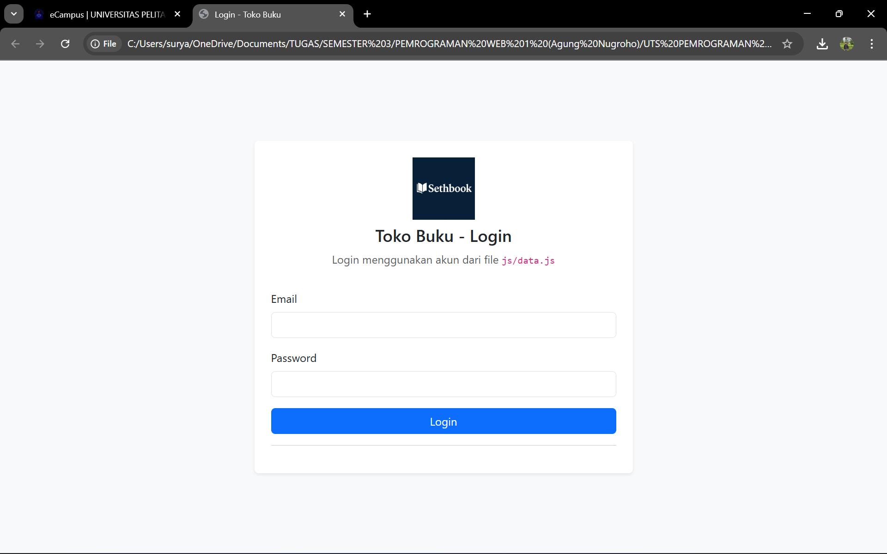
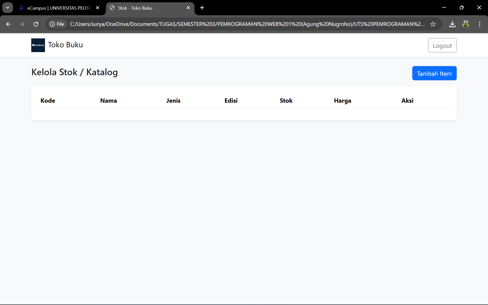
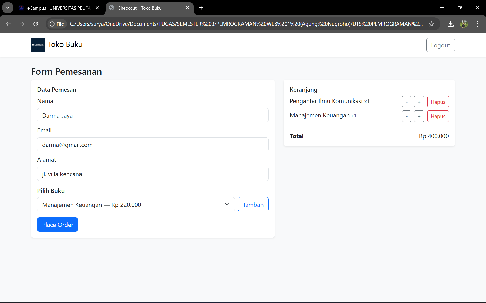
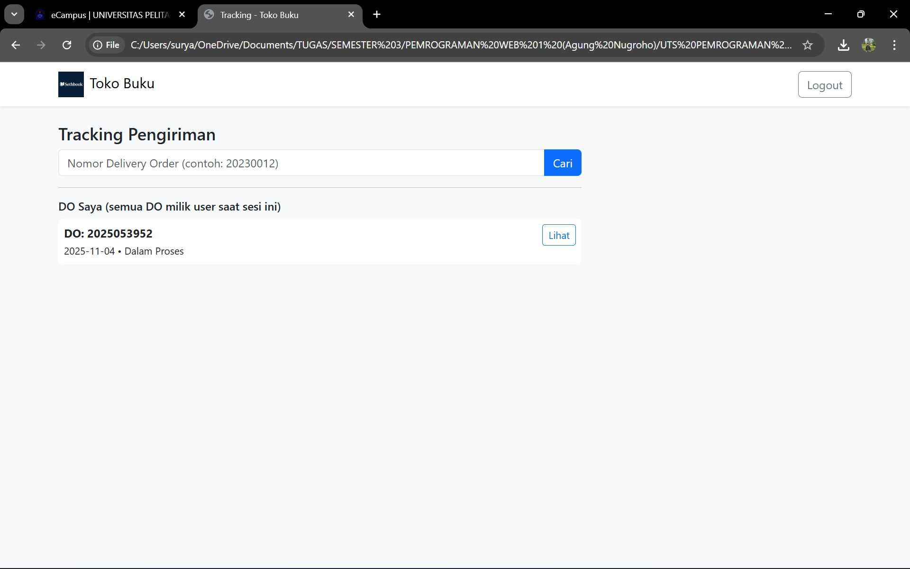
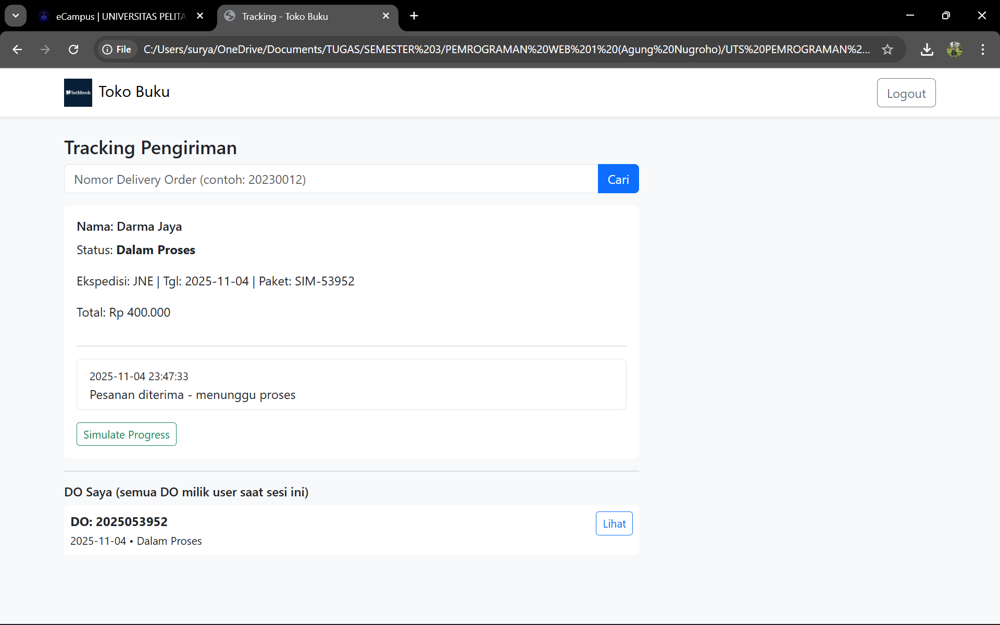
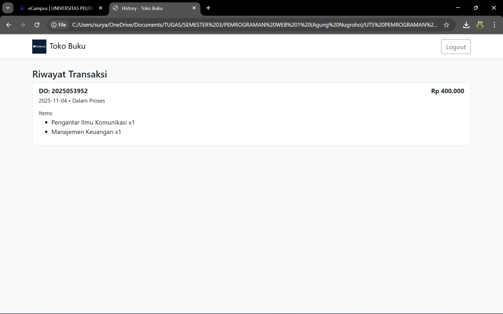

# 📚 Toko Buku - Sistem Manajemen Toko Buku Online

Aplikasi web sederhana untuk mengelola toko buku dengan fitur login multi-role (Admin & User), manajemen katalog, pemesanan, tracking pengiriman, dan riwayat transaksi.



## 🎯 Fitur Utama

### 👤 Sistem Login & Role-Based Access
- **Admin**: Akses penuh ke manajemen stok/katalog
- **User**: Akses ke pemesanan, tracking, dan history transaksi
- Autentikasi menggunakan email & password
- Session management dengan sessionStorage

### 🔐 Akun Default

#### User
- **Email**: `darma@gmail.com` | **Password**: `darma123`
- **Email**: `putra@gmail.com` | **Password**: `putra123`

#### Admin
- **Email**: `surya@gmail.com` | **Password**: `surya123`

---

## 📸 Screenshot Aplikasi

### 🔑 Halaman Login

*Halaman login dengan form email dan password. Mendukung login sebagai Admin atau User.*

---

### 🏠 Dashboard

<table>
  <tr>
    <td width="50%">
      
    </td>
    <td width="50%">
      
    </td>
  </tr>
  <tr>
    <td align="center"><b>Admin Dashboard</b><br/>Menu: Informasi Stok/Katalog</td>
    <td align="center"><b>User Dashboard</b><br/>Menu: Pemesanan, Tracking, History</td>
  </tr>
</table>

**Fitur Dashboard:**
- Greeting sesuai waktu (pagi/siang/sore/malam)
- Badge role (Admin/User)
- Statistik: Total koleksi buku, total users, stok tersisa
- Tampilan buku teratas dengan cover
- Menu navigasi berbasis role

---

### 📦 Manajemen Stok (Admin Only)

*Admin dapat mengelola katalog buku: tambah, edit, dan hapus data buku.*

**Fitur:**
- Tabel katalog lengkap (Kode, Nama, Jenis, Edisi, Stok, Harga)
- Button "Tambah Item" untuk menambah buku baru
- Aksi Edit & Hapus untuk setiap item
- Data tersimpan in-memory (session)

---

### 🛒 Pemesanan (User Only)

*Form pemesanan dengan keranjang belanja interaktif.*

**Fitur:**
- Form data pemesan (auto-filled dari profil user)
- Dropdown pilih buku dari katalog
- Keranjang belanja dengan fitur:
  - Tambah/kurang quantity (+/-)
  - Hapus item
  - Kalkulasi total otomatis
- Button "Place Order" untuk submit pesanan
- Generate Delivery Order (DO) otomatis

---

### 📍 Tracking Pengiriman (User Only)


*Daftar DO milik user dan form pencarian DO.*


*Detail tracking dengan timeline perjalanan paket dan tombol simulasi progress.*

**Fitur:**
- Search bar untuk cari DO berdasarkan nomor
- List semua DO milik user yang sedang login
- Detail tracking menampilkan:
  - Nama penerima
  - Status pengiriman (Dalam Proses, Dalam Perjalanan, Selesai Antar)
  - Info ekspedisi, tanggal kirim, nomor paket
  - Total pembayaran
  - Timeline perjalanan paket
- **Simulate Progress**: Tombol untuk demo update status (untuk testing)

---

### 📜 History Transaksi (User Only)

*Riwayat transaksi lengkap dengan detail items yang dibeli.*

**Fitur:**
- Daftar transaksi user (sorted terbaru)
- Detail per transaksi:
  - Nomor DO
  - Tanggal pemesanan
  - Status (Dalam Proses, Selesai)
  - Total pembayaran
  - List items yang dibeli beserta quantity

---

## 📚 Katalog Buku Default

| Kode Barang | Nama Buku | Jenis | Edisi | Stok | Harga |
|-------------|-----------|-------|-------|------|-------|
| ASIP4301 | Pengantar Ilmu Komunikasi | Buku Ajar | 2 | 548 | Rp 180.000 |
| EKMA4002 | Manajemen Keuangan | Buku Ajar | 3 | 392 | Rp 220.000 |
| EKMA4310 | Kepemimpinan | Buku Ajar | 1 | 278 | Rp 150.000 |
| BIOL4211 | Mikrobiologi Dasar | Buku Ajar | 2 | 165 | Rp 200.000 |
| PAUD4401 | Perkembangan Anak Usia Dini | Buku Ajar | 4 | 204 | Rp 250.000 |

---

## 🗂️ Struktur File

```
toko-buku/
├── index.html          # Halaman login
├── dashboard.html      # Dashboard utama (Admin & User)
├── stok.html          # Kelola stok/katalog (Admin only)
├── checkout.html      # Form pemesanan (User only)
├── tracking.html      # Tracking pengiriman (User only)
├── history.html       # Riwayat transaksi (User only)
├── css/
│   └── style.css      # Custom styling
├── js/
│   ├── data.js        # Data: pengguna, katalog buku, tracking
│   └── script.js      # Logic & interaktivitas aplikasi
├── assets/
│   └── logo.png       # Logo aplikasi
└── screenshots/       # Screenshot untuk dokumentasi
    ├── 01-login.png
    ├── 02-dashboard-admin.png
    ├── 03-dashboard-user.png
    ├── 04-stok.png
    ├── 05-checkout.png
    ├── 06-tracking.png
    ├── 07-tracking-detail.png
    └── 08-history.png
```

---

